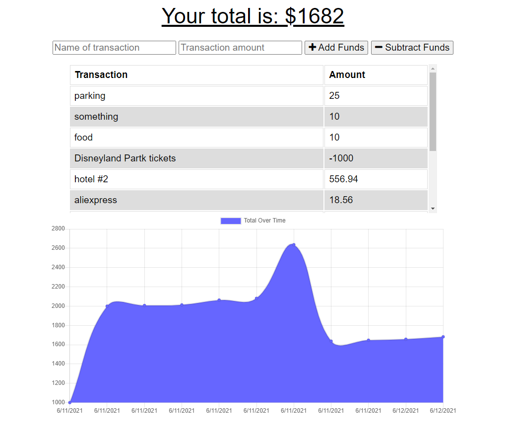

# Budget Tracker

## Description 
Update an existing budget tracker application to allow for offline access and functionality. The user will be able to add expenses and deposits to their budget with or without a connection. If the user enters transactions offline, the total should be updated when they're brought back online.

## User Story
AS AN avid traveler
I WANT to be able to track my withdrawals and deposits with or without a data/internet connection
SO THAT my account balance is accurate when I am traveling 

## Table of Contents 

* [Usage](#usage)
* [License](#license)
* [Technologies](#Technologies)
* [Screenshots](#Screenshots)
* [Questions](#questions)

## Usage 
Open the Link in the browser and enter your expenses. In case of poor connectivity or loss of internet connection, the data in saved locally. Once the internet connection is restored, the data is updated in the database.

View Budget Tracker
[here](https://evening-taiga-49403.herokuapp.com/)

## License

This Application is covered under : 

[mit](https://choosealicense.com/licenses/mit)
 

## Technologies
* JavaScript
* Node.js
* MongoDB
* Mongoose
* Express.js

## Screenshots

## Questions
View my Github Profile at [CynthiaMohan](http://github.com/CynthiaMohan)
 
Reach me with more questions <cynthiamohan1@gmail.com>

